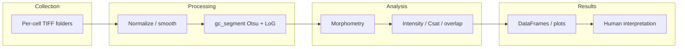
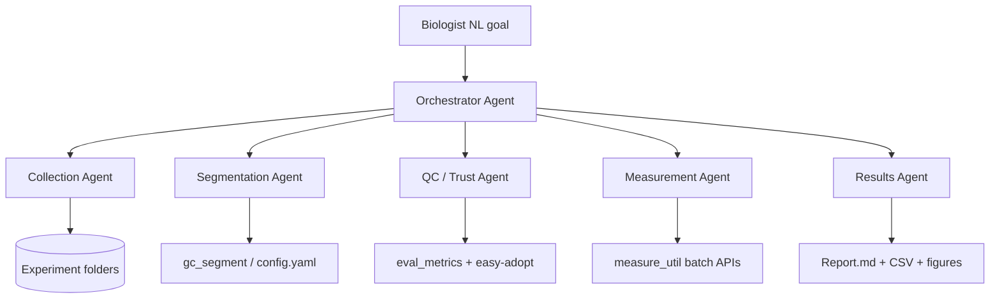

# Agentic AI Integration for the Nucleolus Segmentation Pipeline

**Date:** 2026-07-10  
**Status:** Research / design proposal (not yet implemented)  
**Repo:** `nucleolus_segmentation_public`  
**Related:** [Easy-adopt](https://github.com/ashapeng/Easy-adopt), Allen Cell `aics-segmentation`

## 1. Problem statement

This repository is a **notebook-driven, classical-CV pipeline** for nucleolar granular-component (GC) segmentation and quantification in *C. elegans* confocal stacks. Biologists currently:

1. Collect / organize per-cell folders (`Composite_stack.tif`, `nuclei_mask.tif`, `background_mask.tif`)
2. Run `nucleolus_seg.ipynb` (interactive + batch loops) to produce `gc.tif` / `holes.tif` / `hole_filled.tif`
3. Run feature and intensity notebooks for morphometry, Csat, CV/QCD, and colocalization
4. Manually QC in napari and interpret plots

**Goal of this research:** define how an **agentic AI system** can own the loop from image collection through processing, analysis, and result generation—while preserving scientific reproducibility and the existing classical segmentation core.

## 2. Current pipeline (as-is)



| Stage | Today | Automation gap |
|-------|--------|----------------|
| Collection | Manual folder layout | No ingest / inventory / channel validation agent |
| Processing | `seg_util.gc_segment` + notebook batch | Params in `config.yaml`; notebooks still hard-code overrides; no QC gate |
| Analysis | `measure_util` + notebooks | No single CLI; stage grouping and plots are manual cells |
| Results | Tables + matplotlib | No narrative report, anomaly flags, or experiment-level summary |
| Tool choice | Classical CV fixed; Easy-adopt external | No agent that decides when to keep GC pipeline vs try StarDist/Cellpose |

**Important constraint:** production segmentation is classical CV (Gaussian, Otsu, LoG). Deep learning appears only via **Easy-adopt** trust evaluation, not as the default segmenter.

## 3. Related work (agentic bioimage analysis)

| System | Pattern | Relevance here |
|--------|---------|----------------|
| **Agentic-J** (2026) | Multi-agent harness over ImageJ/Fiji + Python/napari; NL goals → executable, traceable scripts; coder/debugger/QA/stats sub-agents | Closest product pattern: wrap domain tools, don’t retrain the LLM |
| **Gently** | Orchestrator + perception agents; hardware/organism plugins; VLM at decision points | Useful if collection expands to live acquisition; overkill for offline TIFF folders |
| **GenCELLAgent / Orion** | Agents driving CellProfiler/QuPath or iterative segmentation feedback | Pattern for “try tool → QC → retry” loops |
| **Easy-adopt** (this lab) | Structure/tool contracts → Trust Report (RED/AMBER/GREEN), not a single IoU | Natural **Tool-Adoption Agent** already aligned with `nucleolus_gc` |

**Design principle borrowed from Agentic-J / Gently:** the LLM is the planner; **deterministic Python functions remain the actuators**. Agents call tools; they do not invent segmentation math ad hoc.

## 4. Approaches considered

### Approach A — Thin orchestrator over existing APIs (recommended)

Expose `gc_segment`, `batch_measure_shape`, intensity helpers, `eval_metrics`, and Easy-adopt as **typed tools**. One orchestrator agent plans a run; optional specialist agents for QC and reporting.

| Pros | Cons |
|------|------|
| Minimal rewrite; reuses `config.yaml` and tests | Still need a CLI/batch entry point (notebooks are not tool-friendly) |
| Reproducible: same functions humans call | Less “creative” code generation than Agentic-J |
| Easy-adopt plugs in cleanly | Collection still assumes existing folder contract |

### Approach B — Code-generating agent (Agentic-J style)

Agent writes/edits notebooks or scripts per experiment, debugs failures, stores mistake memory.

| Pros | Cons |
|------|------|
| Flexible for novel analyses | Harder to audit; risk of silent metric drift |
| Good for exploratory science | Duplicates logic already in `seg_util` / `measure_util` |

### Approach C — Replace classical CV with DL agents end-to-end

Train/fine-tune or call Cellpose/StarDist as primary GC segmenter; agent tunes and interprets.

| Pros | Cons |
|------|------|
| May generalize to new markers | Easy-adopt already shows high IoU can be **biologically wrong** for GC |
| Modern stack | Breaks validated Weber Lab workflow without a trust gate |

**Recommendation:** **Approach A**, with Easy-adopt as a gated optional path to DL tools (Approach C only after GREEN trust). Use limited code-generation (Approach B) only for *new* analysis questions not covered by `measure_util`.

## 5. Recommended architecture

### 5.1 Agent roles



| Agent | Responsibility | Primary tools |
|-------|----------------|---------------|
| **Orchestrator** | Parse goal, plan stages, decide retries, enforce config | Plan + invoke specialists |
| **Collection** | Inventory cells, validate required files, resolve channels/resolution | `list_cells`, `validate_cell_folder`, `read_config` |
| **Segmentation** | Run GC segmentation per cell or batch; write masks | `gc_segment`, `save_masks`, optional param sweep |
| **QC / Trust** | Per-cell QC heuristics; optional Easy-adopt for alternate tools | `mask_stats`, `eval_metrics`, `easy_adopt_run` |
| **Measurement** | Morphometry, intensity, overlap, stage grouping | `batch_measure_shape`, `concentration_gc`, `overlap_3channel`, `group_gc_measure_df` |
| **Results** | Tables, plots, narrative summary, anomaly list | `box_plot`, `overlap_heatmap`, `write_report` |

Single-agent with the same tool set is a valid MVP; multi-agent is preferred once tool count and retry logic grow.

### 5.2 Stage-by-stage agentic behavior

#### Image collection

- Discover `{date}_{L1-L4}/{cell_id}/` trees.
- Assert presence of `Composite_stack.tif`, `nuclei_mask.tif`, `background_mask.tif`.
- Infer larval stage via `extract_stage`; flag unparseable IDs.
- Confirm channel convention (ch2 = LPD-7 GC marker) or ask for override in config.
- Emit a **run manifest** (JSON): cells included/excluded, reasons, microscope resolution from `config.yaml`.

*Out of scope for v1 unless hardware is connected:* live microscope control (Gently-style). Collection here means **dataset ingest and validation**.

#### Image processing / segmentation

- Load config defaults; allow goal-level overrides (`sigma`, `local_adjust`, LoG range).
- Call `gc_segment(raw, nucleus_mask, ...)` → write `gc.tif`, `holes.tif`, `hole_filled.tif`.
- **Feedback loop:** if QC fails (empty mask, GC fraction outside ~5–40% of nucleus, mask outside nucleus), adjust `local_adjust` / size filters within bounded ranges and retry (max N attempts), else escalate to human or Easy-adopt evaluation.
- Do **not** let the LLM invent new filter math; only tune declared parameters.

#### Data analysis

- Run morphometry (`batch_measure_shape`) then intensity/colocalization helpers.
- Aggregate by larval stage; compute summary stats.
- Flag outliers (e.g. extreme solidity, NaN Csat from empty nucleoplasm—already handled in code).

#### Generate results

- Export CSV + figures to a dated `runs/<run_id>/` directory.
- Produce a short **Trust + Results report**: what ran, params, QC flags, Easy-adopt outcomes if any, biological summary (counts, size trends L1→L4, overlap highlights).
- Keep every tool call logged for reproducibility (Agentic-J-style traceability without requiring ImageJ).

### 5.3 Tool interface (proposed)

Stable Python entry points the agent may call (to be implemented as a thin CLI or MCP/tool layer):

```text
inventory_experiment(root) -> Manifest
validate_cell(cell_dir) -> ValidationResult
run_gc_segment(cell_dir, config_overrides?) -> MaskPaths
qc_masks(cell_dir) -> QCReport
run_easy_adopt(cell_dir, tool, structure="nucleolus_gc") -> TrustReport
measure_shapes(master_folder, mask_name="gc.tif") -> DataFrame
measure_intensity(cell_dir | batch) -> DataFrame
group_by_stage(dfs) -> DataFrame
plot_and_export(df, out_dir) -> ArtifactPaths
write_run_report(manifest, qc, metrics, out_dir) -> ReportPath
```

Prerequisite engineering (non-AI): extract notebook batch loops into these functions so agents never scrape `.ipynb` cells.

### 5.4 Trust and safety

1. **Deterministic core:** segmentation/measurement stay in tested modules (`tests/test_seg_util.py`, `tests/test_measure_util.py`).
2. **Bounded autonomy:** parameter search only within ranges documented in `config.yaml` / structure contract.
3. **Easy-adopt gate:** alternate DL tools require non-RED trust before replacing `gc_segment` in a run.
4. **Human-in-the-loop:** napari review optional but recommended for first N cells of a new experiment; agent pauses on RED QC.
5. **Ephemeral vs durable storage:** run artifacts should land in object storage or a mounted volume if deployed on Render-like hosts (local disk is ephemeral).

### 5.5 Technology options for the agent harness

| Option | Fit |
|--------|-----|
| **Python tool-calling agent** (LangGraph / custom loop + OpenAI/Anthropic tools) | Best fit for wrapping existing modules |
| **MCP server** exposing the tools above | Good if Cursor/Claude Code should drive the pipeline interactively |
| **CLI `nucleolus-agent run --root ... --goal "..."`** | Best for batch/HPC and reproducibility |
| Full Agentic-J / ImageJ stack | Unnecessary unless Fiji plugins are required |

**Recommended stack for this repo:** CLI + typed tools first; optional MCP wrapper for interactive use; LangGraph (or equivalent) only if multi-agent retries become complex.

## 6. Phased delivery

### Phase 0 — Agent-ready API (no LLM yet)

- Deduplicate notebook batch into `batch_gc_segment(master_folder)` and intensity batch APIs.
- Align notebook call signatures with `gc_segment` (today notebooks may pass unused `background_mask`).
- Write `runs/` manifest + CSV export helpers.
- Wire `eval_metrics` + simple QC heuristics (GC/nucleus area ratio, empty mask).

### Phase 1 — Single orchestrator agent

- Tool-calling agent over Phase 0 APIs.
- Natural-language goals like: “Segment all L2 cells under `test_image`, measure shapes, write a report.”
- Logging of params and tool traces.

### Phase 2 — QC + Easy-adopt specialist

- Auto-retry param tuning; escalate failures.
- Optional `easy-adopt --tool stardist|cellpose --structure nucleolus_gc`.

### Phase 3 — Results narrative + experiment comparison

- Cross-run diffs, stage-trend language, figure captions.
- Optional VLM for visual QC of mid-Z slices (assistive, not ground truth).

## 7. Success criteria

- End-to-end run from a validated experiment root to `runs/<id>/report.md` **without editing notebooks**.
- Same numeric outputs (within float tolerance) as current notebook path for a fixed config.
- QC catches empty/out-of-nucleus masks before measurement.
- Easy-adopt RED blocks silent swap to an inappropriate DL tool.
- Unit tests continue to pass; new tests cover inventory, QC gates, and report generation.

## 8. Non-goals (v1)

- Replacing `gc_segment` with a trained neural net as default.
- Live microscope hardware control.
- Training or fine-tuning foundation models in-repo.
- Full Agentic-J / Fiji dependency.

## 9. Open decisions (for implementers / stakeholders)

1. **Interface:** CLI-only vs MCP vs both?
2. **LLM provider:** API-based vs local open-weight for lab data policies?
3. **Collection scope:** offline folders only, or future acquisition hooks?
4. **Default on QC fail:** auto-tune, skip cell, or hard stop?
5. **Where reports live:** git-ignored `runs/` vs lab object store?

## 10. Summary

The highest-leverage path is **not** to rebuild segmentation with generative AI. It is to make the existing classical pipeline **agent-operable**: inventory → `gc_segment` → QC/Easy-adopt → `measure_util` → reproducible report, with an orchestrator that plans and retries inside safe bounds. That matches emerging bioimage agent systems (Agentic-J, Gently) while staying faithful to this lab’s validated GC workflow and trust-report philosophy.
